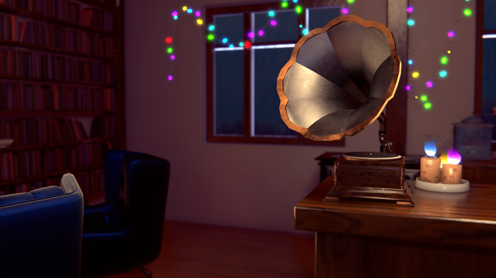
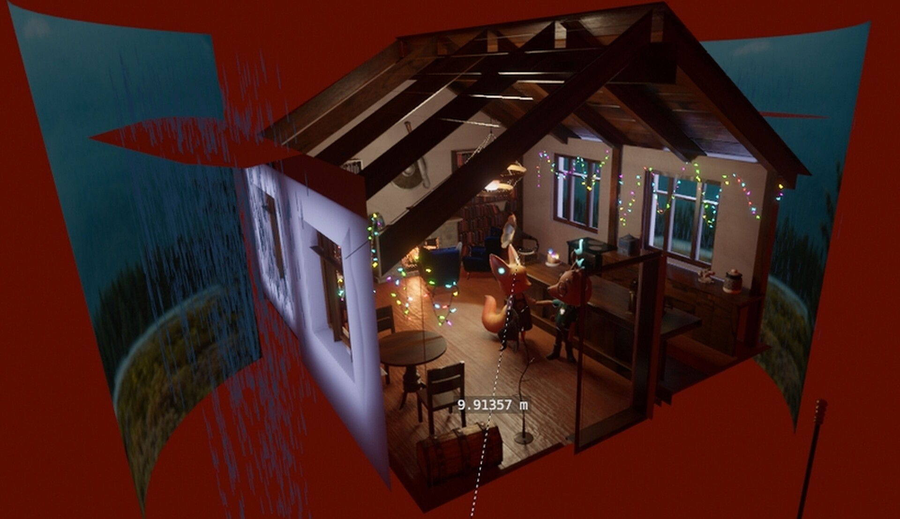

    <iframe src="https://player.vimeo.com/video/1002971564?badge=0&amp;autopause=0&amp;player_id=0&amp;app_id=58479" frameborder="0" allow="autoplay; fullscreen; picture-in-picture; clipboard-write" style="position:absolute;top:0;left:0;width:100%;height:100%;" title="The Sound of Delight"></iframe>
  

  

**By Aram Marquez** - [arammarquez.com](https://arammarquez.com)  
Song: Piel Canela · Eydie Gormé · El Trio Los Panchos  
"Outside cabin" photo by Michael Heuser.  

For more information on the short, visit:  
https://delight.arammarquez.com/

## A1 Poster

## Extra Snapshots

## Outside Snapshot
